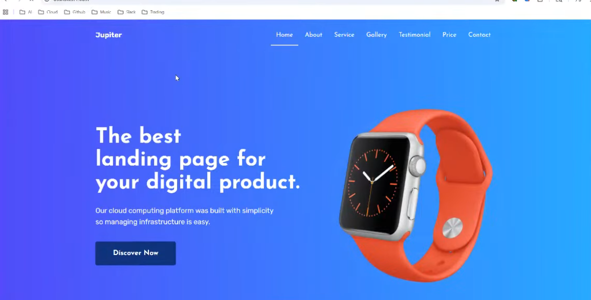

---
# **Deploying a Secure & Scalable Static Website on AWS**


---
# **Deploying a Secure & Scalable Static Website on AWS**
## **📌 Project Summary**

In this project, I designed and deployed a **secure, scalable, and production-ready static website** on Amazon Web Services (AWS).
The solution reflects real-world DevOps practices by combining modern cloud infrastructure, automation, and security principles to deliver a **highly available and fault-tolerant web application**.

This project demonstrates my ability to architect cloud solutions, automate deployments, and implement best practices across networking, compute, storage, DNS, security, and load balancing services.


# ** Architecture Overview**

I implemented a **tiered network architecture** within a custom Virtual Private Cloud (VPC), ensuring strong security, controlled routing, and isolation of resources.

### **🔹 Networking Components**

* **VPC** – Provided isolated environment for all AWS resources
* **Public Subnets** – Hosted the Application Load Balancer and Bastion Host
* **Private Subnets** – Hosted EC2 instances running the web application
* **Internet Gateway** – Enabled public connectivity
* **NAT Gateway** – Allowed private instances to install updates securely
* **Route Tables** – Directed traffic appropriately between public and private tiers

### **🔹 Security**

* **Security Groups** – Implemented least-privilege access
* **IAM Roles & Policies** – Allowed EC2 to retrieve code from S3 securely
* **HTTPS Enforcement** – Achieved through Amazon Certificate Manager (ACM)
* **Private EC2 Instances** – Not directly accessible from the internet

### **🔹 Compute & Application Layer**

* **EC2 Instances** – Hosted the static website
* **Application Load Balancer (ALB)** – Distributed traffic across multiple instances
* **Target Group** – Managed health checks and routing
* **Auto Scaling Group (ASG)** – Adapted capacity based on traffic demands

### **🔹 Storage & Content**

* **S3 Bucket** – Stored application ZIP file and static assets
* **IAM Role** – Granted EC2 read access to S3 without storing credentials

### **🔹 Domain & Encryption**

* **Route 53** – Managed DNS for the custom domain
* **ACM** – Issued SSL certificate for secure HTTPS communication

---


# **⚙️ EC2 Bootstrap Script (User Data)**

This automation script configures the EC2 server and deploys the web content automatically during instance launch:

```bash
#!/bin/bash

export S3_URI="s3://tboy3bucket1/jupiter.zip"

yum update -y
yum install -y httpd unzip awscli

systemctl enable httpd
systemctl start httpd

cd /var/www/html
rm -rf *

aws s3 cp "$S3_URI" .
unzip jupiter.zip

cp -R jupiter/* .

rm -rf jupiter jupiter.zip

systemctl restart httpd
```

This script eliminates manual configuration, ensures consistency, and accelerates deployments.

---                                               |

---

# **🧪 Deployment Workflow**

### **1. Infrastructure Setup**

I provisioned the VPC, subnets, NAT Gateway, IGW, route tables, and Security Groups.

### **2. Application Upload**

Website ZIP file stored in an S3 bucket.

### **3. EC2 Configuration**

A launch template with user-data script automatically installs Apache, retrieves files from S3, and serves the application.

### **4. High Availability Setup**

The ALB forwards traffic to EC2 instances inside private subnets.

### **5. Auto Scaling**

The application scales dynamically based on CPU utilization or load.

### **6. DNS & HTTPS Configuration**

Route 53 routes traffic to ALB using alias records, and ACM provides the SSL certificate.

---

# **🔐 Some Security Measure I Took**

* I hosted backend EC2 instances in **private subnets**
* I only exposed the Load Balancer publicly
* 
* HTTPS enforced using ACM
* Bastion host enables controlled SSH access
* Security Groups restrict traffic to only required ports

---

# **📌 Project Outcome**

The final result is a:

* **Secure** * **Scalable** * **Highly available** * **Cost-effective** * **Production-grade static website hosted on AWS.**

This design can easily be adapted for larger applications or transitioned into a CI/CD workflow using CodePipeline, GitHub Actions, or Terraform automation.




---

# **📬 Want to Learn More?**

Feel free to explore the repository, open issues, or fork the project.
Connect with me on LinkedIn if you'd like to discuss DevOps, cloud engineering, or AWS projects.

---


